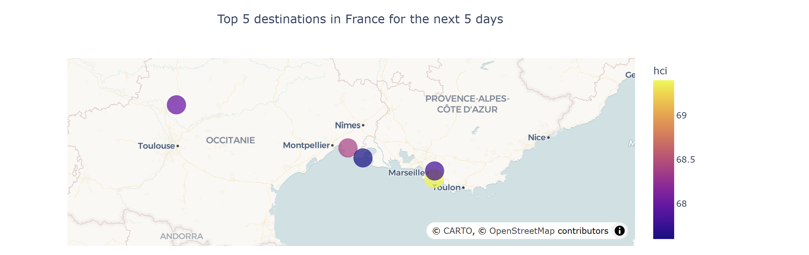
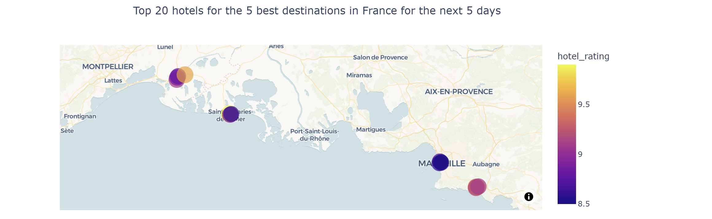

# Kayak project

This project aims at building a **travel recommendation application** that suggests where to plan the next holidays, based on **short-term weather forecasts** and **hotel ratings**. This application focuses on the **top-35 French cities** to visit, as ranked by One Week In.com.


## Repository structure

```text
.
├── data/
│   ├── hotel_weather_final.csv     # Final dataset
│   ├── city_list.txt               # List of the 35 destinations
│   ├── gps.csv                     # City GPS coordinates
│   ├── hotel_info.csv              # Scraped hotel information
│   └── weather.csv                 # Forecast weather data
├── outputs/
│   ├── map_top5_destinations.html
│   ├── map_top5_destinations.png
│   ├── map_top20_hotels.html
│   └── map_top20_hotels.png
├── kayak.ipynb                     # Main notebook to run the analysis
├── scrape.hotel.py                 # Web scraping script used by the notebook
├── .gitignore
└── README.md
```

## Prerequisites

- Python 3.9+
- AWS account with a S3 bucket and an RDS MySQL instance
- IAM user with permissions for S3 and RDS

### Required Python packages
Install the packages needed to run the notebook:
```bash
pip install json requests pandas numpy playwright boto3 sqlalchemy plotly kaleido python-dotenv pymysql

# Install Playwright browsers, used to run the scraping script
playwright install
```
### Environment variables
This project requires environment variables for API access and cloud resources.
Create a `.env` file at the root of the project with the following variables:
```text
OPENWEATHERMAP_API_KEY = your_api_key
AWS_ACCESS_KEY_ID = your_aws_access_key
AWS_SECRET_ACCESS_KEY = your_aws_secret_key
AWS_BUCKET_NAME = your_s3_bucket_name
DB_USERNAME = your_db_username
DB_PASSWORD = your_db_password
DB_HOSTNAME = your_db_hostname
DB_NAME = your_db_name
```


## Project workflow

This project follows a structured data pipeline:

1. **Data collection**
    - **Hotel data** scraped from booking.com 
    - **Weather data forecasts** retrieved via [OpenWeatherMap API](https://openweathermap.org/forecast5)
    - **City GPS coordinates** retrieved via geolocation [Nominatim API](https://nominatim.openstreetmap.org/search)

2. **Data cleaning and enrichment**
    - Computation of a **Holiday Climate Index** (HCI)
    - Merging weather, hotel, and geographical data into a single dataset

4. **Data storage**
   - Final dataset stored in an AWS S3 datalake
   - Structured data loaded into a MySQL database (AWS RDS)

5. **Data visualization**
   - SQL queries to extract insights
   - Interactive maps displaying:
     - Top 5 destinations with the best upcoming weather
     - Top 20 best-rated hotels in these destinations


## Holiday Climate Index (HCI)

Destinations are ranked using the **Holiday Climate Index (HCI)**,
an index designed for urban tourism and based on stated tourist climate preferences
(Scott et al., 2016, [link](http://doi.org/10.3390/atmos7060080)).

The HCI combines multiple climate dimensions:
- Thermal comfort (felt temperature)
- Aesthetic component (cloud cover)
- Physical component (precipitation and wind)

Raw meteorological variables are mapped to **ordinal rating scales**
using predefined thresholds.
These ratings are intended to reflect tourist perceived comfort.


## Deliverables

* An **enriched dataset** combining hotel data, weather forecasts and GPS coordinates, stored in an **AWS S3 bucket**

* A **MySQL database** hosted on **AWS RDS**

* **Interactive maps**:
    - Top 5 cities with the best weather within the next 5 days
    - Top 20 best-rated hotels in these destinations





## Tech stack

| **Task** | **Technology / Tool** |
|------|-----------------|
| Data retrieval from APIs | `requests` |
| Web scraping | `Playwright`  |
| Data cleaning | `pandas`, `numpy` |
| Storage in a datalake | AWS S3, `boto3` |
| Storage in a data warehouse | AWS RDS (MySQL), `SQLAlchemy`, `pymysql`|
| Data visualization | `Plotly`|
| Environment variables management | `python-dotenv` |
