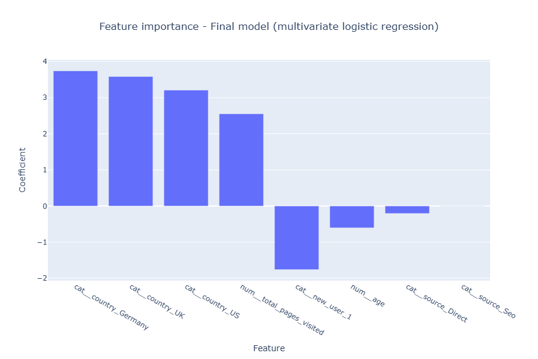

# Conversion rate

This project aims at **building a classification model to predict user conversion to the newsletter of [Data Science Weekly](www.datascienceweekly.org)**.

## Dataset

The dataset contains 284,580 observations about the traffic of the website of Data Science Weekly:
- decision of subscription of the user
- characteristics and web behaviour of the user: country, age, new user or not, source of traffic, total pages visited.

## Project workflow

- **Exploratory data analysis and preprocessings** on the labeled dataset

- **Training several classification models**:
    - baseline model: univariate logistic regression
    - improved models: multivariate logistic regression, random forest, XGBoost

- **Evaluation of the models' performance and selection of the best model**

- **Submission of predictions** using the unlabeled dataset

## Deliverables

- Jupyter notebook: `conversion_rate.ipynb`
- One submission of predictions using the best model (multivariate logistic regression): `.csv` file in the `exports` folder

## Tech stack
| **Category**       | **Technology / Library**                          |
|---------------------|------------------------------------------|
| Programming language           | Python                       |
| Data processing                 | Pandas, NumPy                         |
| Machine learning                | Scikit-learn, xgboost                         |
| Data visualisation    | Matplotlib, Plotly                     |

## Results

### Model selection

The table below shows the results of the **GridSearchCV** process, including the best **F1-score**, **precision**, **recall**, and **accuracy** for each model.

| Model               | Best F1-score | Standard deviation of F1-score  | Best Precision | Best Recall | Best Accuracy | 
|---------------------|------------|-----------|--------------|-------------|-------------|
| Multivariate Logistic Regression   | 0.765 | 0.003      | 0.854      | 0.692         | 0.986      | 
| Random Forest          | 0.755       | 0.006      | 0.847         | 0.681        | 0.986      | 
| XGBoost                | 0.707       | 0.009      | 0.613         | 0.837        | 0.978      | 

F1-score is the selection criteria because it provides a balanced measure of a model's performance (combining precision and recall). Thus, **Multivariate Logistic Regression is selected as the best model**. 

>*For each model family (Logistic Regression, Random Forest, XGBoost), the 'best model' refers to the model with the optimal hyperparameters identified by GridSearchCV, which maximizes the F1-score.  
>The 'best' scores represents the scores achieved by this 'best model'.  
> Accuracy is included for informational purposes, but was not considered a selection criteria due to the imbalanced nature of the target variable.*

### Feature importance

### Recommandations
- Improve the attractiveness and content of the website in order to encourage users to explore more pages, and attract new users to visit the website again
- Target communication and content efforts to be more appealing to younger users (for instance, communicating on social networks)
- Analyze the reasons why direct and SEO traffics have a negative or null impact on the conversion rate
- Improve SEO strategy