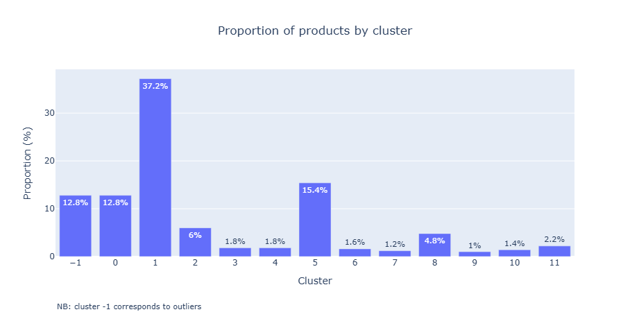
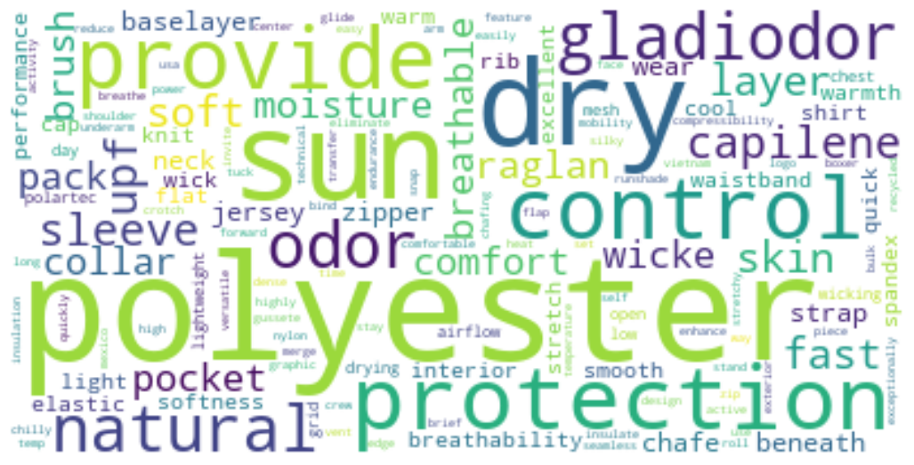
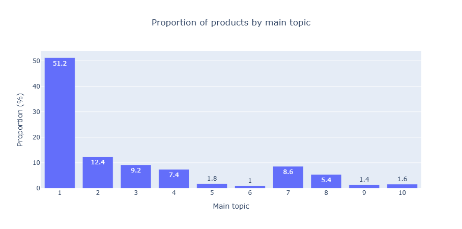

# The North Face e-commerce

This project aims to develop solutions to increase online sales on The North Face's website by:
- deploying a **recommender system** to suggest additional products to users, similar to the items they are already interested in.
- **improving the product catalog structure** using topic extraction. The goal is to use unsupervised methods to challenge the existing categories.

## Dataset

The dataset contains a corpus of 500 product descriptions from The North Face's product catalog.

## Project workflow

- **Preprocessing**
    - Text cleaning: remove punctuation and special characters, convert text to lowercase, remove stop words (generic and custom), tokenize and lemmatize
    - Text vectorization using TF-IDF

- **Clustering** : identify groups of products with similar descriptions, using the **DBSCAN** algorithm

- **Recommender system**: build a simple recommendation algorithm based on the clustering results

- **Topic modeling**: apply **Latent Semantic Analysis (LSA)** to automatically extract latent topics from product descriptions

## Deliverables

- Jupyter Notebook: `north_face.ipynb` (containing the entire workflow, from data preprocessing to model training).
- Recommendation algorithm:  in Section 4 of the Jupyter notebook.
- Clustering and topic modeling results: visualisations and augmented dataset are saved in the `exports/` folder.

## Tech stack
| **Category**                    | **Library**                                          |
|---------------------------------|------------------------------------------------------|
| Data processing                 | pandas, numpy                                        |
| Text processing and NLP         | spaCy, contractions                                  |
| Machine learning                | scikit-learn (TfidfVectorizer, DBSCAN, TruncatedSVD) |
| Data visualisation              | matplotlib, plotly, wordcloud                        |

## Results

### Clustering
DBSCAN can detect clusters with arbitrary shapes and identify outliers, without requiring a predefined number of clusters.
This algorithm is applied on TF-IDF representations of cleaned product descriptions, using cosine distance.

Hyperparameters (`eps`, `min_samples`) are tuned empirically in order to get between 10 and 20 clusters with a minimal proportion of outliers.

**The selected model (eps=0.7 and min_samples=5) identifies 12 clusters (excluding noise) and classifies 12.8% of products as noise.** 
The distribution of products across clusters is heterogenous, with one large cluster (37% of products) and several smaller ones. This reflects the diversity of the product descriptions (common vs niche products).

The quality of the clustering, assessed using the silhouette score (on non-noise points), is 0.14: the cluster separation is weak but positive. It is not very surprising because of the shared vocabulary used in product descriptions. 

Wordclouds display some overlap in the vocabulary (for example, polyester appears in half of the clusters), but semantic logic can be found, for instance:
- cluster 0 groups technical products designed to manage moisture and odors;
- cluster 5 contains comfortable products made with natural materials (ex: organic cotton);
- cluster 8 groups merino wool products.

Wordcloud of cluster 0:

### Topic modeling
Latent Semantic Analysis (LSA) is applied to extract latent topics from the products' descriptions.  

TruncatedSVD is performed on the TF-IDF matrix to reduce its dimensionality. **The selected model consists of 10 components, explaining 21% of the variance**. This number was chosen to ensure that, when assigning a main topic to each product, each topic contains a sufficient number of items (at least 5 products per main topic).

The distribution of products by main topic is heterogeneous: one main topic is dominant (more than half of the products), while others seem to be very specific (4 main topics with less than 2% of the products each). This reflects the diversity of the products sold by The North Face.

Wordclouds were used to visualize the top 15 words per topic. We propose the following interpretations:  
- Topic 1: materials and features of clothing  
- Topic 2: eco-friendly clothing  
- Topic 3: merino wool clothing: focus on odor-resistance  
- Topic 4: organic cotton jeans  
- Topic 5: merino wool clothing: focus on washing  
- Topic 6: lower body clothing with stretch and sun protection
- Topic 7: technical sportswear lingerie  
- Topic 8: accessories  
- Topic 9: upper body clothing with sun protection  
- Topic 10: outdoor products  